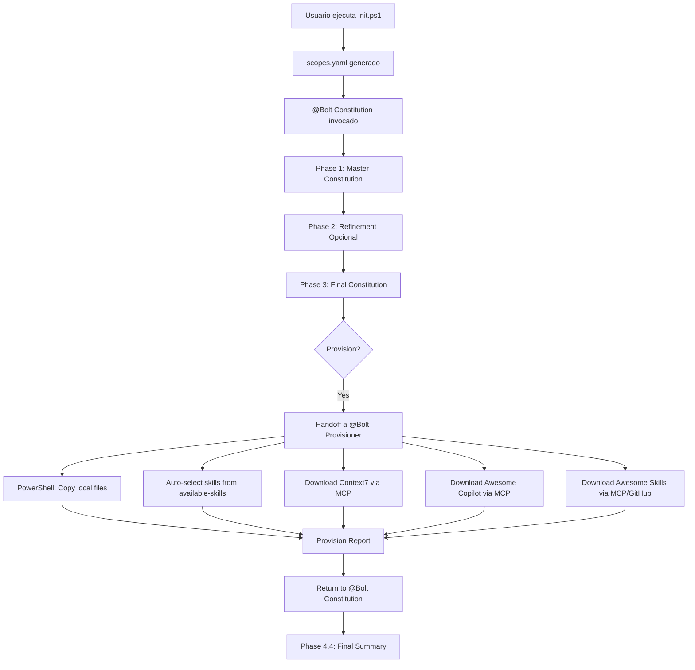

# Sistema de Provisioning Mejorado con Agente Especializado

## Fecha: 2026-02-24

## Resumen

Se ha creado un **agente especializado** `@Bolt Provisioner` que se encarga de todo el provisioning de recursos, incluyendo:

1. ✅ Auto-selección de skills desde `.boltf/available-skills/`
2. ✅ Descarga desde Context7 (via MCP)
3. ✅ Descarga desde Awesome Copilot (via MCP)
4. ✅ Descarga desde Awesome Skills/GitHub (via MCP)
5. ✅ Copia de archivos locales (via PowerShell)

## Arquitectura



## Componentes Creados

### 1. Agente @Bolt Provisioner

**Archivo**: `.github/agents/bolt-provisioner.agent.md`

**Responsabilidades**:

- Ejecutar PowerShell script para copiar archivos locales
- Auto-seleccionar skills relevantes de `.boltf/available-skills/`
- Descargar recursos desde Context7 via MCP
- Descargar recursos desde Awesome Copilot via MCP
- Descargar skills desde Awesome Skills/GitHub via MCP
- Generar reporte detallado con metadata de todas las fuentes
- Manejar errores (MCP no disponible, download fallido, etc.)

**Acceso a MCPs**:

- `context7/*` - Para descargar documentación de Microsoft Learn, etc.
- `awesome-copilot/*` - Para descargar instructions desde Awesome Copilot
- GitHub MCP (si disponible) - Para clonar skill directories

**Lógica de Auto-Selección de Skills**:

| Scope Active      | Tech Stack   | Skills Copiados                                                               |
| ----------------- | ------------ | ----------------------------------------------------------------------------- |
| `backend`         | .NET         | `dotnet-backend/*`, `testing-must/tdd-*`, `functional-tests/gherkin-reqnroll` |
| `backend`         | Node.js      | `testing-must/*`, `functional-tests/*`                                        |
| `frontend`        | Angular      | `angular/*`, `ui-common/playwright-skill`                                     |
| `frontend`        | Vue          | `vue/*`, `ui-common/playwright-skill`                                         |
| `cloud-platform`  | Azure        | `azure/*`, `bolt-framework/bolt-*`                                            |
| `cloud-platform`  | Terraform    | (download from awesome_skills si habilitado)                                  |
| `data`            | Any          | `testing-must/*`                                                              |
| `ai`              | Any          | `bolt-framework/bolt-testing-discipline`                                      |
| `work-management` | Azure DevOps | `azdo/*`                                                                      |
| `work-management` | GitHub       | `github/*`                                                                    |

### 2. Handoff desde @Bolt Constitution

**Actualización**: `.github/agents/bolt-constitution.agent.md`

**Cambio**: Añadido handoff button en frontmatter:

```yaml
handoffs:
  - label: 🚀 Provision Resources (Phase 4)
    agent: Bolt Provisioner
    prompt: |
      Provision all resources for active scopes...
      Active scopes: [list]
      Tech stack: [from constitution]
```

**Flujo**:

1. @Bolt Constitution completa Phase 1-3
2. En Phase 4, presenta botón de handoff
3. Usuario hace clic → @Bolt Provisioner toma control
4. @Bolt Provisioner completa provisioning
5. @Bolt Provisioner retorna a @Bolt Constitution
6. @Bolt Constitution muestra resumen final (Phase 4.4)

## Source Types Soportados

### 1. `local_file`

**Manejado por**: PowerShell script
**Ejemplo**:

```yaml
- id: cloud-platform-constitution
  kind: templates
  enabled: true
  source:
    type: local_file
    path: scopes/cloud-platform/memory/constitution.md
  destination:
    folder: memory
    name: constitution.md
```

**Acción**: Copy-Item desde `.boltf/scopes/...`

### 2. `context7`

**Manejado por**: @Bolt Provisioner via MCP
**Ejemplo**:

```yaml
- id: cloud-appservice-bicep-context7
  kind: templates
  enabled: true
  source:
    type: context7
    library: /microsoftdocs/azure-docs
    query: Define Linux App Service and Deployment from GitHub using Bicep
  destination:
    folder: infra/bicep
    name: appservice-linux-github.bicep
```

**Acciones**:

1. Load MCP: `tool_search_tool_regex({ pattern: "mcp_context7" })`
2. Resolve library: `mcp_context7_resolve-library-id(...)`
3. Query docs: `mcp_context7_query-docs(...)`
4. Extract code/content
5. Add source comment/frontmatter
6. Save to destination

**Archivo generado** incluye header:

```bicep
/*
Source: Context7
Library: /microsoftdocs/azure-docs
Query: Define Linux App Service...
URL: https://learn.microsoft.com/...
Fetched: 2026-02-24 16:45:30
License: Microsoft Learn terms
*/

// Bicep code here...
```

### 3. `awesome_copilot`

**Manejado por**: @Bolt Provisioner via MCP
**Ejemplo**:

```yaml
- id: cloud-bicep-best-practices-awesome
  kind: instructions
  enabled: true
  source:
    type: awesome_copilot
    collection: azure-cloud-development
    item_path: instructions/bicep-code-best-practices.instructions.md
  destination:
    folder: .github/instructions
    name: bicep-code-best-practices.instructions.md
```

**Acciones**:

1. Load MCP: `tool_search_tool_regex({ pattern: "mcp_awesome_copil" })`
2. Load collection: `mcp_awesome_copil_load_collection(...)`
3. Load instruction: `mcp_awesome_copil_load_instruction(...)`
4. Add frontmatter
5. Save to destination

**Archivo generado** incluye frontmatter:

```markdown
---
source: awesome_copilot
collection: azure-cloud-development
item: instructions/bicep-code-best-practices.instructions.md
url: https://github.com/github/awesome-copilot/...
fetched: 2026-02-24 16:46:15
license: repository-defined
---

[Content from Awesome Copilot]
```

### 4. `awesome_skills`

**Manejado por**: @Bolt Provisioner via MCP (GitHub) o fetch
**Ejemplo**:

```yaml
- id: cloud-hashicorp-terraform-style-guide-awesome-skills
  kind: skills
  enabled: true
  source:
    type: awesome_skills
    repository: https://github.com/hashicorp/agent-skills
    skill_path: terraform/code-generation/skills/terraform-style-guide
  destination:
    folder: .claude/skills
    name: terraform-style-guide
```

**Acciones**:

1. Load GitHub MCP (if available): `tool_search_tool_regex({ pattern: "mcp_github" })`
2. Clone/fetch skill directory con todos sus archivos
3. Add `.source.yaml` metadata file
4. Save to destination

**Directorio generado**:

```text
.claude/skills/terraform-style-guide/
├── SKILL.md
├── examples/
├── templates/
└── .source.yaml  ← Metadata
```

**Metadata `.source.yaml`**:

```yaml
source: awesome_skills
repository: https://github.com/hashicorp/agent-skills
skill_path: terraform/code-generation/skills/terraform-style-guide
fetched: 2026-02-24 16:47:00
license: MPL-2.0
```

## Auto-Selección de Skills

### Lógica

**Input**:

- Active scopes (de `scopes.yaml`)
- Tech stack (de `constitution.md` o decisiones wizard)

**Proceso**:

1. Escanear `.boltf/available-skills/` folders
2. Mapear folders a scopes/tech stack activos
3. Para cada skill relevante:
   - Verificar que SKILL.md existe
   - Copiar recursivamente a `.claude/skills/`
   - Añadir a provision report

### Ejemplo Concreto

**Scopes activos**: `backend`, `cloud-platform`, `work-management`
**Tech stack**: .NET, Azure, GitHub Actions

**Skills auto-copiados**:

```text
.claude/skills/
├── bolt-framework/              ← Core (siempre)
├── bolt-adr/                    ← Core (siempre)
├── new-skill/                   ← Core (siempre)
├── markdown-formatting/         ← Core (siempre)
├── backend-testing-dotnet/      ← backend + .NET
├── dotnet-backend-patterns/     ← backend + .NET
├── tdd-red-green-refactor/      ← backend (testing)
├── webapp-testing/              ← backend (testing)
├── gherkin-reqnroll/            ← backend (functional tests)
├── azure-identity-dotnet/       ← cloud-platform + Azure
├── azure-resource-visualizer/   ← cloud-platform + Azure
├── azure-usage/                 ← cloud-platform + Azure
├── architect-diagramer/         ← cloud-platform + Azure
├── github-workflows/            ← work-management + GitHub
├── github-issue-creator/        ← work-management + GitHub
└── github-actions-templates/    ← work-management + GitHub
```

**Total**: 18 skills (4 core + 14 auto-selected)

## Provision Report Mejorado

**Archivo**: `.boltf/memory/provision-report.md`

**Secciones**:

1. **Core Skills** (4 items)
2. **Auto-Selected Skills** (N items con source folder)
3. **Local Scope Files** (M items)
4. **Context7 Downloads** (P items con library, query, URL, timestamp)
5. **Awesome Copilot Downloads** (Q items con collection, path, timestamp)
6. **Awesome Skills Downloads** (R items con repository, path, timestamp)
7. **Statistics Table** (totales por categoría)
8. **Failed Items** (si hubo errores)

**Ejemplo**:

```markdown
# Bolt Setup Constitution - Provision Report

**Generated**: 2026-02-24 16:50:00
**Practice**: Apps & Infra
**Active Scopes**: backend, cloud-platform, work-management

---

## Core Skills (4 items)

- bolt-framework
- bolt-adr
- new-skill
- markdown-formatting

## Auto-Selected Skills (14 items)

| Skill                  | Source Folder   | Scope Match              |
| ---------------------- | --------------- | ------------------------ |
| backend-testing-dotnet | dotnet-backend/ | backend + .NET           |
| azure-identity-dotnet  | azure/          | cloud-platform + Azure   |
| github-workflows       | github/         | work-management + GitHub |

...

## Context7 Downloads (2 items)

| Item                          | Library                   | Query                       | Fetched             |
| ----------------------------- | ------------------------- | --------------------------- | ------------------- |
| appservice-linux-github.bicep | /microsoftdocs/azure-docs | Define Linux App Service... | 2026-02-24 16:45:30 |

...

## Statistics

| Category                  | Count  |
| ------------------------- | ------ |
| Core Skills               | 4      |
| Auto-Selected Skills      | 14     |
| Local Files               | 3      |
| Context7 Downloads        | 2      |
| Awesome Copilot Downloads | 3      |
| **Total**                 | **26** |
```

## Flujo Usuario

### 1. Inicialización

```powershell
.\Init.ps1 -OutputDirectory ./my-project -ProjectType green
```

- Selecciona Practice: "Apps & Infra"
- Auto-selecciona scopes: backend, frontend, cloud-platform
- Responde wizard questions
- Tech stack: .NET backend, Angular frontend, Azure cloud, Bicep IaC

**Genera**:

- `scopes.yaml` con decisiones
- Basic `constitution.md`

### 2. Provisioning (@Bolt Constitution)

Usuario abre Copilot chat y escribe:

```text
@Bolt Constitution setup constitution
```

**Phase 1**: Generate constitution.master.md

- ✅ Merge base + scope constitutions
- ✅ Backup original

**Phase 2**: Interactive Refinement (opcional)

- ⏭️ User skips (o responde preguntas)

**Phase 3**: Generate constitution.md (final)

- ✅ Create focused constitution
- ✅ Ask: "Provision resources?"

**Phase 4**: Provision Resources

- 🚀 **Handoff a @Bolt Provisioner**

### 3. Provisioning (@Bolt Provisioner)

**Automatic execution**:

**Step 1**: PowerShell local copy

```text
✓ Core skills (4)
✓ Local scope files (3)
```

**Step 2**: Auto-select from available-skills

```text
Scanning .boltf/available-skills/...
✓ Found 14 relevant skills
✓ Copying to .claude/skills/
```

**Step 3**: Download Context7

```text
⬇️ Downloading 2 items from Context7...
✓ appservice-linux-github.bicep
✓ azure-devops-dotnet-pipeline.prompt.md
```

**Step 4**: Download Awesome Copilot

```text
⬇️ Downloading 3 items from Awesome Copilot...
✓ bicep-code-best-practices.instructions.md
✓ kubernetes-deployment-best-practices.instructions.md
✓ dotnet-architecture-good-practices.instructions.md
```

**Step 5**: Download Awesome Skills

```text
⬇️ Cloning 1 skill from GitHub...
✓ terraform-style-guide/ (from hashicorp/agent-skills)
```

**Step 6**: Generate report

```text
✓ provision-report.md updated
```

**Return to @Bolt Constitution**

### 4. Final Summary (@Bolt Constitution)

```markdown
## ✅ Bolt Framework Setup Complete!

**Provisioned**: 26 items total

- Core Skills: 4
- Auto-Selected: 14
- Local: 3
- Context7: 2
- Awesome Copilot: 3

**Next Steps**:

1. Review constitution: `.boltf/memory/constitution.md`
2. Explore skills: `.claude/skills/` (26 total)
3. Start building: `@Bolt Framework`
```

## Beneficios

1. **Automatización total**: Skills relevantes se copian automáticamente
2. **Multi-source**: Soporta local, Context7, Awesome Copilot, GitHub
3. **Especialización**: Agente dedicado con MCPs evita token waste
4. **Trazabilidad completa**: Metadata en todos los archivos
5. **Error resilience**: Manejo graceful de MCP unavailable
6. **Extensible**: Fácil añadir nuevos source types
7. **Tech-stack aware**: Auto-selección basada en decisiones del usuario

## Testing

### Test Case 1: Backend .NET + Azure

**Input**:

- Scopes: backend, cloud-platform
- Stack: .NET, Azure, Bicep

**Expected**:

- Core: 4 skills
- Auto: ~10 skills (dotnet-backend/*, azure/*, testing-must/\*)
- Context7: Si items enabled en scope.yaml
- Awesome Copilot: Si items enabled

### Test Case 2: Frontend Vue + GitHub

**Input**:

- Scopes: frontend, work-management
- Stack: Vue, GitHub Actions

**Expected**:

- Core: 4 skills
- Auto: ~8 skills (vue/*, ui-common/*, github/\*)
- Context7: Si items enabled
- Awesome Copilot: Si items enabled

## Próximos Pasos

- [ ] Implementar caching de MCP collections para evitar re-fetch
- [ ] Añadir soporte para `source.type: npm_package`
- [ ] Implementar auto-update de skills obsoletos (content_hash check)
- [ ] Añadir comando CLI: `bolt provision --scope backend`
- [ ] Publicar @Bolt Provisioner como agente standalone

## Referencias

- Agente Constitution: `.github/agents/bolt-constitution.agent.md`
- Agente Provisioner: `.github/agents/bolt-provisioner.agent.md`
- Script PowerShell: `.boltf/scripts/powershell/Invoke-BoltSetupConstitution.ps1`
- Available Skills: `.boltf/available-skills/README.md`
- Scope Example: `.boltf/scopes/cloud-platform/scope.yaml`
