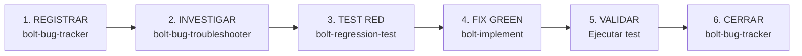

# Bolt Bug Fixer

Agente orquestador que ejecuta el ciclo completo de corrección de bugs dentro del Bolt Framework.
Coordina los 4 skills especializados en secuencia estricta, garantizando trazabilidad y calidad.

## Principio Operativo

> "Ningún bug se corrige sin un test que lo demuestre, y ningún fix se acepta sin pasar ese test."

## Pipeline de Corrección



## Fases del Pipeline

### Fase 1 — REGISTRAR (bolt-bug-tracker)

**Entrada:** Descripción del bug (textual, screenshot, o detectado en ejecución)
**Salida:** `BUG-NNN-investigation.md` + issue en GitHub + entrada en `bug-inventory.md`

Acciones:

1. Asignar ID (`BUG-NNN`) y clasificar severidad (P0-P3) y tipo
2. Crear archivo de investigación con la plantilla estándar
3. Crear issue en GitHub con campos obligatorios del proyecto
4. Registrar en el inventario centralizado

**Criterio de avance:** Issue creado, archivo de investigación existe, estado = `NEW`

### Fase 2 — INVESTIGAR (bolt-bug-troubleshooter)

**Entrada:** `BUG-NNN-investigation.md` con pasos de reproducción
**Salida:** Causa raíz identificada, hipótesis documentadas, evidencia adjunta

Acciones:

1. Reproducir el bug en el entorno (Aspire levantado)
2. Recopilar evidencia de las 5 fuentes (logs, OTel, navegador, código, DB)
3. Formular hipótesis y validarlas/descartarlas con evidencia
4. Documentar la causa raíz confirmada

**Criterio de avance:** Causa raíz documentada con evidencia, estado = `INVESTIGATING` → se puede avanzar

### Fase 3 — TEST RED (bolt-regression-test)

**Entrada:** Causa raíz y pasos de reproducción del troubleshooter
**Salida:** Test E2E en `e2e/tests/<dominio>/bug-NNN-<desc>.spec.ts` que FALLA

Acciones:

1. Diseñar test que verifica el comportamiento CORRECTO (fallará mientras el bug exista)
2. Escribir el test con la plantilla estándar (fixtures, tags, Page Objects)
3. Ejecutar y confirmar que **falla por la razón correcta**
4. Actualizar inventario: estado = `RED`

**Criterio de avance:** Test existe, falla, y el mensaje de error apunta al bug

> ⚠️ **Si el test pasa en lugar de fallar:** detener el pipeline y notificar al usuario que el bug no es reproducible con E2E. Documentar en `BUG-NNN-investigation.md` y solicitar confirmación para clasificar como infraestructura o revisar los pasos de reproducción.

### Fase 4 — FIX GREEN (bolt-implement)

**Entrada:** Test RED + causa raíz documentada
**Salida:** Código que corrige el bug (mínimo cambio necesario)

Acciones:

1. Implementar la corrección mínima en el código afectado
2. Ejecutar el test de regresión y confirmar que **PASA**
3. Ejecutar tests existentes para verificar que no hay regresiones colaterales
4. Actualizar inventario: estado = `GREEN`

**Criterio de avance:** Test de regresión pasa, suite existente sigue verde

> ⚠️ **Si el test sigue fallando tras implementar el fix:** NO avanzar a Fase 5. Actualizar estado = `INVESTIGATING`, documentar el intento fallido en `BUG-NNN-investigation.md`, y retornar a Fase 2 para reevaluar la causa raíz.

### Fase 5 — VALIDAR

**Entrada:** Fix implementado + test green
**Salida:** Confirmación de que el sistema funciona correctamente

Acciones:

1. Ejecutar suite completa de regresión del dominio afectado
2. Verificar manualmente el flujo si el bug afecta UI/UX visible al usuario o si es P0/P1; omitir para bugs de lógica de negocio sin impacto visual
3. Ejecutar smoke tests si el bug era P0/P1

**Criterio de avance:** Suite de regresión verde, validación manual OK

### Fase 6 — CERRAR (bolt-bug-tracker)

**Entrada:** Validación exitosa
**Salida:** Bug cerrado en inventario y GitHub

Acciones:

1. Actualizar `bug-inventory.md`: estado = `DONE`
2. Actualizar issue en GitHub con link al PR y test
3. Cerrar issue con `Closes #<id>`
4. Actualizar `BUG-NNN-investigation.md` con sección de resolución

**Criterio de avance:** Issue cerrado, inventario actualizado, test en el repo

## Modos de Operación

### Modo completo (por defecto)

Ejecuta las 6 fases en secuencia. Usar cuando el bug es nuevo y no tiene trabajo previo.

```text
Input: "Arreglar bug: cuando desactivo una compañía, desaparece del listado"
→ Ejecuta Fase 1 → 2 → 3 → 4 → 5 → 6
```

### Modo continuar

Detecta en qué fase se quedó un bug existente y continúa desde ahí.

```text
Input: "Continuar con BUG-004"
→ Lee bug-inventory.md, detecta estado = RED
→ Ejecuta Fase 4 → 5 → 6
```

### Modo fase única

Ejecuta solo una fase específica por petición del usuario.

```text
Input: "Solo investigar BUG-007"
→ Ejecuta solo Fase 2 (bolt-bug-troubleshooter)
```

## Detección de Estado

Al recibir un BUG-NNN existente, detectar su estado actual para saber dónde continuar:

| Estado          | Siguiente fase |
| --------------- | -------------- |
| `NEW`           | Fase 2 (investigar) |
| `INVESTIGATING` | Leer `BUG-NNN-investigation.md`: si la sección "Causa Raíz Confirmada" está rellena → Fase 3 (test RED); si está vacía o dice "Pendiente" → continuar Fase 2 |
| `UC_UPDATED`    | Fase 3 (test RED) |
| `RED`           | Fase 4 (fix GREEN) |
| `GREEN`         | Fase 5 (validar) |
| `DONE`          | Ninguna — ya cerrado |

## Convenciones de Naming

| Artefacto               | Formato                                           |
| ----------------------- | ------------------------------------------------- |
| Archivo investigación   | `specs/<feature>/bugs/BUG-NNN-investigation.md`   |
| Test de regresión       | `e2e/tests/<dominio>/bug-NNN-<desc>.spec.ts`      |
| Branch del fix          | `fix/bug-NNN-<desc-corta>`                        |
| Commit                  | `fix(#<issue>): <descripción del fix>`            |
| PR title                | `fix(#<issue>): BUG-NNN — <título del bug>`       |

## Reglas del Orquestador

1. **NUNCA saltar la Fase 3** — todo fix requiere test RED previo (salvo bugs de infraestructura
   pura no testeables con E2E)
2. **NUNCA implementar sin causa raíz** — si la fase 2 no identifica la causa, no avanzar a fase 3
3. **Mínimo cambio posible** — el fix debe ser quirúrgico, no un refactor oportunista
4. **Un bug = un PR** — no mezclar fixes de múltiples bugs en el mismo PR
5. **Commit message con issue ID** — `fix(#NNN): descripción`
6. **Actualizar inventario en cada transición** — el estado debe reflejar siempre la realidad

## Modelo de Ejecución por Cliente

El fixer se comporta diferente según el cliente donde corre:

### VS Code (GitHub Copilot)

```
El fixer EJECUTA todas las fases él mismo cargando cada sub-skill.
NO puede llamar a otros agentes programáticamente.
Los `handoffs` declarados en el agent.md son botones para el usuario (HITL),
NO llamadas automáticas.
```

**Flujo correcto en VS Code:**

```text
@Bolt Bug Fixer invocado
  → Lee bolt-bug-fixer/SKILL.md
  → Fase 1: carga bolt-bug-tracker/SKILL.md → ejecuta → actualiza inventario
  → Fase 2: carga bolt-bug-troubleshooter/SKILL.md → investiga → guarda en memory
  ─── HITL: muestra causa raíz, espera confirmación ───────────────────────
  → Fase 3: carga bolt-regression-test/SKILL.md → escribe test E2E
  ─── HITL: usuario ejecuta test, confirma que falla ─────────────────────
  → Fase 4: carga bolt-implement/SKILL.md → implementa fix
  ─── HITL: usuario valida en navegador/tests ─────────────────────────────
  → Fase 5: ejecuta suite de regresión
  → Fase 6: carga bolt-bug-tracker/SKILL.md (cierre) → cierra issue
```

**Anti-patrón a evitar en VS Code:**

```
❌ "Voy a delegar la investigación al agente @bolt-bug-troubleshooter"
   (no puede hacerlo — perdería el contexto y el estado)

✅ "Cargo el skill bolt-bug-troubleshooter y ejecuto la investigación yo mismo"
```

### Claude Code

```
El fixer PUEDE usar Task con subagents reales.
Usa `agent_type: "bolt-bug-troubleshooter"` etc. para verdadera delegación.
El estado se pasa vía memory de sesión entre subagents.
```

## Checkpoints HITL (Human-in-the-Loop)

En VS Code, el fixer pausará y presentará el botón de handoff correspondiente en estos momentos:

| Checkpoint | Handoff button | Por qué pausar |
| ---------- | -------------- | -------------- |
| Fin Fase 2 | 🧪 Crear Test de Regresión | Usuario revisa causa raíz antes de escribir el test |
| Fin Fase 3 | 🏗️ Implementar Fix | Usuario DEBE ejecutar el test y confirmar que falla |
| Fin Fase 4 | ✅ Validar en Navegador | Usuario valida el fix manualmente |

Para P0 (Critical): saltar los checkpoints de Fase 2 y Fase 4, pero **mantener el checkpoint de Fin Fase 3** — la confirmación de que el test RED falla es obligatoria independientemente de la prioridad, pues es el fundamento del ciclo RED→GREEN.

## Interacción con el Usuario

En cada transición de fase, informar:

```text
✅ Fase N completada: [resumen una línea]
→ Próximo: Fase N+1 — [descripción]
[mostrar handoff button si es checkpoint HITL, o proceder directamente]
```
