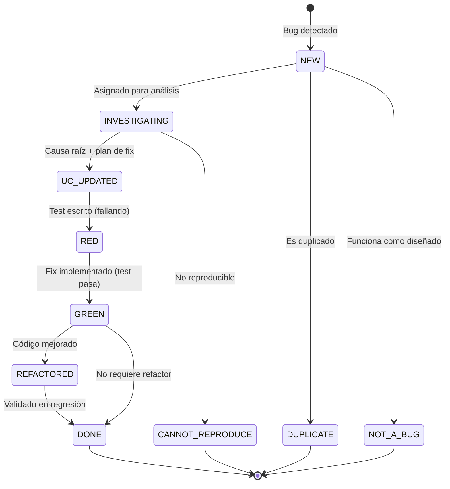

# Bolt Bug Tracker

Skill de registro y gestión del ciclo de vida de bugs dentro del Bolt Framework.
Estandariza cómo se detectan, documentan, clasifican, investigan y verifican los defectos.

## Principios Fundamentales

1. **Todo bug es un ciudadano de primera clase** — tiene ID, issue, spec de investigación y test
   de regresión.
2. **Reproducibilidad ante todo** — si no se puede reproducir, no se puede arreglar.
3. **Trazabilidad completa** — de síntoma a causa raíz a fix a test de regresión.
4. **No reabrir bugs cerrados** — una regresión es un bug nuevo vinculado al original.
5. **Bug-driven development** — cada fix sigue Red-Green-Refactor con test E2E de regresión.

## Estructura de Archivos

Cada feature con bugs mantiene un inventario centralizado y un archivo de investigación por bug:

```text
specs/<feature>/
├── requirements/
│   └── bug-inventory.md          # Tabla centralizada de todos los bugs
└── bugs/
    ├── BUG-001-investigation.md  # Investigación detallada por bug
    ├── BUG-002-investigation.md
    └── ...
```

## Metodología de asociación del bug a la feature

Cuando no se conoce la feature, seguir este árbol de decisión para determinar dónde registrar el bug:

1. Si la feature es conocida → continuar directamente al paso 2 del flujo de registro.
2. Si la feature es desconocida → buscar el área funcional del bug en el código fuente y en los specs existentes.
3. Si se encuentra una spec → asociar el bug a esa spec y usar `specs/<feature>/requirements/bug-inventory.md`.
4. Si no se encuentra spec Y existe `specs/bugs/bug-inventory.md` → preguntar al usuario: ¿añadir al inventario global o crear una nueva spec?
5. Si no hay spec Y no hay inventario global → preguntar al usuario: ¿crear el inventario global (`specs/bugs/bug-inventory.md`) o una nueva spec para asociar el bug?

## Convención de Identificadores

- **Formato**: `BUG-NNN` (secuencial dentro de la feature, 3 dígitos con padding)
- **Scope**: local a la feature de estabilización / sprint
- **Cross-reference**: cada bug DEBE tener un issue en GitHub (`gh#XXX`)

## Flujo de Registro (paso a paso)

### 1. Detección

Al detectar un comportamiento inesperado:

1. Confirmar que no es un duplicado (buscar en `bug-inventory.md`)
2. Asignar el siguiente ID disponible (`BUG-NNN`)
3. Clasificar severidad y tipo (ver tablas abajo)
4. Determinar feature(s) afectada(s)

### 2. Documentación — Crear archivo de investigación

Crear `specs/<feature>/bugs/BUG-NNN-investigation.md` con esta plantilla:

```markdown
# BUG-NNN: <Título conciso del problema>

## Metadata

| Property       | Value                              |
| -------------- | ---------------------------------- |
| Bug ID         | BUG-NNN                            |
| Issue          | gh#XXX                             |
| Severidad      | P0/P1/P2/P3                        |
| Tipo           | Funcional/Integración/UI/Datos     |
| Features       | <feature1>, <feature2>             |
| Estado         | NEW                                |
| Detectado      | YYYY-MM-DD                         |
| Detectado por  | <quién/cómo se descubrió>          |

## Síntomas Observables

<Descripción clara de lo que el usuario observa vs lo que debería ocurrir>

## Pasos de Reproducción

1. <Paso preciso y reproducible>
2. ...
N. **Resultado:** <Lo que ocurre>
N+1. **Esperado:** <Lo que debería ocurrir>

## Evidencia

<Screenshots, logs, trazas OTel, network traces, etc.>

## Causa Raíz (Investigación)

<Análisis técnico detallado — flujo actual vs flujo esperado, archivos relevantes>

## Hipótesis de Solución

<Propuesta técnica de corrección>

## Impacto

- **Funcional:** <Impacto en el negocio/usuario>
- **Operativo:** <Workarounds necesarios>
- **Datos:** <Inconsistencias de datos producidas>
- **UX:** <Impacto en experiencia de usuario>
```

### 3. Registro en inventario

Añadir fila al inventario determinado en la metodología de asociación (ver arriba). Si el bug está asociado a una spec, usar `specs/<feature>/requirements/bug-inventory.md`. Si se eligió el inventario global, usar `specs/bugs/bug-inventory.md`:

```markdown
| BUG-NNN | <Resumen> | <features> | TBD | P1 | Funcional | ❌ NO | NEW |
```

### 4. Crear Issue en GitHub

Crear issue con:

- **Título**: `[BUG-NNN] <Resumen conciso>`
- **Labels**: `bug`, `<severidad>` (P0/P1/P2/P3), `<tipo>` (funcional/integración/UI/datos)
- **Body**: Link al archivo de investigación + síntomas + pasos de reproducción
- **Project**: el GitHub Project configurado, con Status = Backlog, Priority según severidad
- **Sub-issue de**: La feature padre (si aplica)

### 5. Investigación (delegar a `bolt-bug-troubleshooter`)

El skill `bolt-bug-troubleshooter` se encarga del análisis de causa raíz usando:

- Trazas de consola (Aspire structured logs)
- Trazas de navegador (DevTools, Playwright)
- Trazas OTel (distributed tracing)
- Código fuente (handlers, eventos, repositorios)
- Base de datos (estado de datos, consultas)

### 6. Ciclo de corrección (TDD)

Una vez identificada la causa raíz:

1. **RED** — Escribir test E2E que reproduce el bug (DEBE fallar)
2. **GREEN** — Implementar el fix mínimo (test DEBE pasar)
3. **REFACTOR** — Mejorar calidad sin romper tests

### 7. Verificación y cierre

1. Test E2E pasa consistentemente (no flaky)
2. Regresión completa de la feature no se rompe
3. Actualizar `bug-inventory.md`: Estado → GREEN si el test pasa pero aún no se ha cerrado el PR, o DONE una vez el PR está fusionado y el issue cerrado.
4. Cerrar issue con `Closes #XXX` en el PR

## Clasificación de Severidad

| Nivel | Nombre   | Criterio                                                    | SLA Resolución |
| ----- | -------- | ----------------------------------------------------------- | -------------- |
| P0    | Crítico  | Bloquea operativa, pérdida de datos, seguridad comprometida | Inmediato      |
| P1    | Alto     | Funcionalidad principal rota, workaround difícil            | Sprint actual  |
| P2    | Medio    | Funcionalidad secundaria afectada, workaround fácil         | Sprint +1      |
| P3    | Bajo     | Cosmético o edge case raro                                  | Backlog        |

## Clasificación de Tipo

| Tipo        | Descripción                                              | Ejemplos                              |
| ----------- | -------------------------------------------------------- | ------------------------------------- |
| Funcional   | Lógica de negocio incorrecta                             | Filtro no aplica, cálculo erróneo     |
| Integración | Fallo en comunicación entre servicios                    | Evento no publicado, API no responde  |
| UI          | Error visual o de interacción en frontend                | Layout roto, dato no renderiza        |
| Datos       | Inconsistencia, corrupción o datos huérfanos             | FK rota, seed incompleto              |
| Config      | Error de configuración (infra, env, secrets)             | redirect_uri, connection string       |
| Regresión   | Algo que funcionaba y dejó de funcionar tras un cambio   | PR introdujo side-effect              |

## Estados del Ciclo de Vida



## Manejo de Estados Terminales Especiales

**Bug duplicado (DUPLICATE):** No crear nuevo issue en GitHub. En el inventario añadir la fila con Estado=DUPLICATE y en el campo Resumen incluir referencia al original (ej. `Duplicado de BUG-005`). Actualizar el archivo de investigación original con una nota sobre el duplicado detectado.

**Bug no reproducible (CANNOT_REPRODUCE):** Actualizar Estado a CANNOT_REPRODUCE en el inventario. Añadir en el archivo de investigación la evidencia intentada y las condiciones probadas. Cerrar el issue con label `cannot-reproduce` y comentario explicativo. No eliminar el archivo de investigación.

## Reglas de Triaje (Triage)

1. **Antes de investigar**: verificar que no es duplicado (buscar síntomas similares)
2. **Severidad P0**: interrumpir sprint actual, asignar inmediatamente
3. **Bug cap**: Si al registrar un bug se detecta que ya hay 3 o más bugs en estado NEW/INVESTIGATING sin cerrar, advertir al usuario antes de continuar con el registro.
4. **Regresión**: siempre P1 mínimo (indica gap en testing)
5. **Cross-service**: requiere investigación con trazas distribuidas (usar `bolt-bug-troubleshooter`)

## Campos Obligatorios (GitHub Issue)

| Campo          | Obligatorio | Notas                                      |
| -------------- | ----------- | ------------------------------------------ |
| Status         | ✅          | Mapeado al estado del ciclo de vida        |
| Priority       | ✅          | Derivado de Severidad (P0→Urgent, P1→High) |
| Effort         | ✅          | Estimado tras investigación                |
| Feature Parent | ✅          | Feature donde se detectó                   |
| Labels         | ✅          | `bug` + severidad + tipo                   |

## Tests de Regresión

Cada bug corregido DEBE tener un test E2E que lo reproduzca:

- **Ubicación**: `e2e/tests/<dominio>/bug-NNN-<descripcion-corta>.spec.ts`
- **Tags obligatorios**: `@regression @bug-NNN @<dominio>`
- **Aserción**: DEBE verificar el comportamiento correcto (no solo ausencia del error)

```typescript
// Ejemplo: e2e/tests/gestion-usuarios/bug-001-invitation-creates-user.spec.ts
test.describe('@regression @bug-001 @integration', () => {
  test('aceptar invitación crea usuario en gestión de usuarios', async ({ page }) => {
    // 1. Pre-condición: invitación existe
    // 2. Acción: aceptar invitación
    // 3. Verificación: usuario aparece en listado
  });
});
```

## Integración con Otros Skills

| Situación                        | Delegar a                    |
| -------------------------------- | ---------------------------- |
| Análisis de causa raíz           | `bolt-bug-troubleshooter`    |
| Implementar fix (TDD)            | `bolt-implement` + `tdd-workflow` |
| Test E2E del bug                 | `playwright-e2e`             |
| Crear issue GitHub               | `github-issues`              |
| PR con fix                       | `git-commit`                 |

## Anti-patrones a Evitar

1. ❌ Reabrir bugs cerrados para regresiones → abrir bug nuevo con link al original
2. ❌ Bugs sin pasos de reproducción → son inútiles, pedir más detalle
3. ❌ Fix sin test de regresión → va a volver a romperse
4. ❌ "Lo arreglé rápido" sin documentar → el conocimiento se pierde
5. ❌ Bugs sin issue en GitHub → no hay trazabilidad ni métricas
6. ❌ Severidad inflada → todo es P0 = nada es P0
