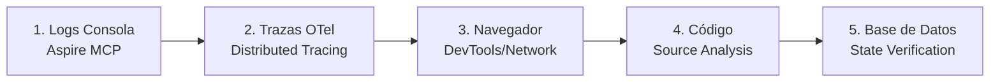
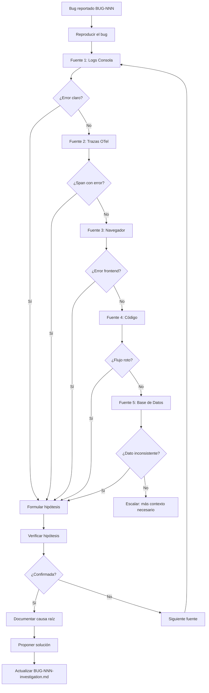

# Bolt Bug Troubleshooter

Skill de análisis sistemático de causa raíz para bugs del Bolt Framework. Opera como un
investigador metódico que recopila evidencia de 5 fuentes complementarias y construye hipótesis
verificables.

## Modo de Invocación

El troubleshooter puede ser invocado de dos formas. **Detectar antes de actuar:**

| Modo | Señal de detección | Comportamiento al terminar |
| ---- | -------------------- | -------------------------- |
| **Standalone** | Prompt del usuario, sin mención de pipeline | Activar Protocolo de Handoff |
| **Pipeline** | El prompt invocador contiene la frase exacta "modo pipeline" como token independiente (no embebida en una palabra más larga ni dentro de una cadena entre comillas) | Guardar en memory y terminar sin handoff |

### Modo pipeline (llamado por bolt-bug-fixer)

1. Ejecutar la investigación completa (mismas 5 fuentes)
2. Actualizar `BUG-NNN-investigation.md` con la plantilla de salida
3. Guardar causa raíz + archivos a modificar en `/memories/session/bug-NNN-pipeline.md`
4. **Terminar limpiamente** — NO activar el Protocolo de Handoff
5. El fixer leerá el resultado de la memory y continuará con la siguiente fase

### Modo standalone (usuario lo invoca directamente)

> **Sin identificador BUG-NNN:** Si el usuario invoca el agente directamente sin proporcionar un
> identificador `BUG-NNN`, solicitar uno antes de continuar. Si el usuario no dispone de uno,
> asignar un ID provisional con el formato `BUG-TMP-<timestamp>` (p. ej. `BUG-TMP-20260723T1530`)
> y anotarlo como provisional en todos los artefactos generados.

1. Ejecutar la investigación completa
2. Actualizar `BUG-NNN-investigation.md`
3. Activar el **Protocolo de Handoff** (ver sección al final)

## Filosofía

> "No diagnostiques desde la intuición. Diagnostica desde la evidencia."

Cada investigación sigue el método científico:

1. **Observar** — recopilar síntomas y evidencia
2. **Hipotetizar** — proponer causas probables basándose en la evidencia
3. **Verificar** — confirmar/descartar hipótesis con datos concretos
4. **Documentar** — registrar hallazgos para el equipo y para el futuro

## Las 5 Fuentes de Evidencia

El troubleshooter consulta estas fuentes en orden de menor a mayor intrusión:



### Fuente 1: Logs de Consola (Aspire Structured Logs)

**Herramientas**: Aspire MCP (`list_structured_logs`, `list_console_logs`)

**Qué buscar**:

- Errores (`LogLevel >= Error`) en el rango temporal del bug
- Warnings que precedieron al error
- Stack traces completos
- Mensajes de dominio (validaciones fallidas, entidades no encontradas)
- Eventos de ciclo de vida (startup, shutdown, reconexión)

**Patrón de consulta**:

```text
1. Identificar el recurso Aspire afectado (usar convención mservice-<dominio>)
2. Filtrar por nivel Error/Warning
3. Filtrar por rango temporal (±5 minutos del incidente)
4. Buscar correlación con TraceId/SpanId
5. Expandir búsqueda a recursos dependientes si no hay pistas
```

**Señales clave en logs .NET**:

- `System.InvalidOperationException` → lógica de negocio mal orquestada
- `Microsoft.EntityFrameworkCore.DbUpdateException` → violación de constraint
- `System.TimeoutException` → recurso no disponible o deadlock
- `System.NullReferenceException` → dato esperado no existe (probar seed/flujo previo)
- `Grpc.Core.RpcException` → fallo de comunicación inter-servicio

### Fuente 2: Trazas OTel (Distributed Tracing)

**Herramientas**: Aspire MCP (`list_traces`, `list_trace_structured_logs`)

**Qué buscar**:

- Spans con `status: ERROR` en la cadena de una petición
- Gaps temporales entre spans (latencia, timeout)
- Spans faltantes (servicio no respondió, evento no se publicó)
- Atributos de span (`http.status_code`, `db.statement`, `messaging.operation`)
- Propagación de contexto rota (TraceId diferente entre servicios)

**Patrón de análisis de traza distribuida**:

```text
1. Obtener el TraceId de la operación fallida (desde logs o desde UI)
2. Listar todos los spans de ese trace → construir la cascada visual
3. Identificar el punto de ruptura: ¿dónde se interrumpe el flujo?
4. Para cada span con error: leer sus logs estructurados asociados
5. Verificar si faltan spans esperados (ej. handler que nunca se ejecutó)
```

**Patrones de error en trazas**:

- **Span termina con error, siguiente span no existe** → el servicio crasheó o no publicó evento
- **Span HTTP 500 sin span hijo** → error no capturado en middleware
- **Span de messaging sin span consumer** → evento publicado pero no consumido
- **Span con duración >> normal** → contención, deadlock, recurso saturado
- **TraceId diferente en servicio downstream** → contexto de propagación roto

### Fuente 3: Trazas de Navegador (DevTools / Playwright)

**Herramientas**: Playwright MCP (`browser_snapshot`, `browser_console_messages`,
`browser_network_requests`), DevTools manual

**Qué buscar**:

- Errores en consola del navegador (JS errors, unhandled rejections)
- Peticiones HTTP fallidas (4xx, 5xx, CORS)
- Peticiones que no se envían (guard bloquea, interceptor filtra)
- Respuestas con payload inesperado (datos vacíos, estructura distinta)
- Timing de peticiones (muy lentas, timeouts)
- Estado del DOM tras la operación (elemento no renderizado)

**Patrón de análisis frontend**:

```text
1. Reproducir el bug con Playwright (browser_navigate → acción → snapshot)
2. Capturar console messages durante la reproducción
3. Capturar network requests (filtrar por endpoint relevante)
4. Verificar respuesta del API: ¿datos correctos? ¿error?
5. Si API responde OK pero UI no muestra → inspeccionar estado del componente
6. Si API no se llama → inspeccionar guards, interceptors, routing
```

**Señales clave en navegador**:

- `401 Unauthorized` → token expirado o falta de scope
- `403 Forbidden` → policy no satisfecha (rol, tenant)
- `404 Not Found` → endpoint renombrado o recurso no existe
- `CORS error` → origen no configurado en backend
- `TypeError: Cannot read properties of undefined` → mapping de datos roto
- `ExpressionChangedAfterItHasBeenCheckedError` → signal/change detection issue

### Fuente 4: Código Fuente (Source Analysis)

**Herramientas**: `read_file`, `grep_search`, `semantic_search`, `vscode_listCodeUsages`

**Qué buscar**:

- El handler/endpoint que procesa la operación fallida
- Flujo de datos: de entrada a persistencia (o publicación de evento)
- Validaciones que podrían rechazar silenciosamente la operación
- Mapeos que podrían perder datos (DTO → Entity, Entity → DTO)
- Eventos de integración: ¿se publican? ¿se consumen? ¿el handler existe?
- Configuración de DI: ¿el servicio está registrado correctamente?

**Patrón de análisis de código**:

```text
1. Localizar el endpoint/handler involucrado (grep por ruta HTTP o nombre comando)
2. Trazar el flujo: Controller → Handler → Repository → DB
3. Identificar puntos de decisión (if/switch que podrían cortocircuitar)
4. Verificar si hay eventos publicados y si existen consumers
5. Revisar los tests existentes: ¿cubren el escenario del bug?
6. Buscar cambios recientes (git log -p) en archivos sospechosos
```

**Heurísticas de código sospechoso**:

- Handler sin publicación de evento de integración (saga incompleta)
- `catch` vacío o que traga excepciones silenciosamente
- Query sin include/join → datos relacionados no cargados
- Mapping manual sin mapear todos los campos
- `FirstOrDefault()` sin null-check posterior
- Value Object en LINQ sin conversión → error EF Core
- Filtro `Where` que excluye datos válidos (ej. `IsActive == true` excluye pendientes)

### Fuente 5: Base de Datos (State Verification)

**Herramientas**: MSSQL MCP (`mssql_run_query`), o lectura directa de EF Core migrations

**Qué buscar**:

- Estado actual de los datos involucrados en el bug
- Existencia/ausencia de registros esperados
- Integridad referencial (FKs huérfanas, datos sin padre)
- Timestamps de creación/modificación (¿se actualizó?)
- Valores de campos clave (¿TenantId correcto? ¿estado correcto?)
- Datos de auditoría (¿quién/cuándo hizo la última operación?)

**Patrón de verificación de datos**:

```text
1. Identificar las tablas involucradas (Entity → tabla via EF mappings)
2. Consultar el registro principal del bug (¿existe? ¿tiene los valores correctos?)
3. Verificar registros relacionados (¿existen en la DB del otro servicio?)
4. Comparar timestamps: ¿la operación llegó a persistir?
5. Revisar datos de auditoría/outbox: ¿el evento fue publicado?
6. Si es Database-per-Service: verificar AMBAS bases de datos
```

**Queries de diagnóstico frecuentes**:

```sql
-- ¿El registro existe?
SELECT * FROM [Schema].[Tabla] WHERE Id = @id;

-- ¿Hay datos huérfanos?
SELECT a.* FROM TablaHija a
LEFT JOIN TablaPadre b ON a.PadreId = b.Id
WHERE b.Id IS NULL;

-- ¿Cuándo fue la última operación?
SELECT TOP 5 * FROM [Schema].[Tabla]
WHERE Email = @email
ORDER BY CreatedAt DESC;

-- ¿El evento de integración se persistió en outbox?
SELECT * FROM [Outbox].[Messages]
WHERE EventType LIKE '%InvitacionAceptada%'
ORDER BY CreatedAt DESC;
```

## Flujo de Investigación Completo



## Plantilla de Salida de Investigación

Al completar el análisis, actualizar el archivo `BUG-NNN-investigation.md` con:

```markdown
## Causa Raíz (Investigación)

### Evidencia Recopilada

#### Logs (Fuente 1)
<Hallazgos de logs de consola/structured>

#### Trazas OTel (Fuente 2)
<TraceId, spans afectados, punto de ruptura>

#### Navegador (Fuente 3)
<Errores de consola, peticiones fallidas, estado DOM>

#### Código (Fuente 4)
<Archivos analizados, flujo identificado, punto de fallo>

#### Base de Datos (Fuente 5)
<Estado de los datos, inconsistencias encontradas>

### Diagnóstico

<Explicación clara del por qué falla, con referencia a la evidencia>

### Archivos Relevantes

| Archivo | Propósito |
| ------- | --------- |
| `ruta/al/archivo.cs` | <Por qué es relevante> |
| ... | ... |

## Hipótesis de Solución

<Propuesta técnica concreta con impacto estimado>

## Archivos a Modificar

| Archivo | Cambio |
| ------- | ------ |
| `ruta/archivo.cs` | <Descripción del cambio> |
| ... | ... |
```

## Técnicas de Troubleshooting Avanzadas

### Correlación Cross-Service (Database-per-Service)

Cuando el bug involucra múltiples microservicios:

1. **Identificar el flujo end-to-end** — ¿qué servicio inicia? ¿cuáles participan?
2. **Verificar publicación de eventos** — ¿el evento se emitió? (outbox table o logs del publisher)
3. **Verificar consumo de eventos** — ¿el consumer se ejecutó? (logs del consumer handler)
4. **Verificar idempotencia** — ¿el mensaje se procesó más de una vez?
5. **Verificar ordenamiento** — ¿los eventos llegaron en orden correcto?

### Análisis de Regresiones

Cuando algo que funcionaba dejó de funcionar:

1. **Git bisect conceptual** — ¿cuál fue el último commit/PR donde funcionaba?
2. **Diff de archivos sospechosos** — `git log --oneline -10 -- <archivo>`
3. **Verificar dependencias** — ¿se actualizó un paquete? ¿cambió una API?
4. **Verificar datos** — ¿cambió el seed? ¿migración alteró schema?
5. **Verificar configuración** — ¿cambió appsettings? ¿variables de entorno?

### Bugs de Timing/Race Conditions

Cuando el bug es intermitente:

1. **Buscar operaciones async sin await** — fire-and-forget sin confirmación
2. **Buscar shared state sin lock** — acceso concurrente a recursos compartidos
3. **Verificar order of operations** — ¿el consumer se registró antes del publish?
4. **Buscar timeouts** — ¿la operación depende de un recurso con latencia variable?
5. **Verificar retry policies** — ¿el retry causa duplicados?

### Bugs de Autorización/Tenant

Cuando el bug aparece solo para ciertos usuarios/tenants:

1. **Verificar claims del token** — ¿tiene el claim esperado? (aud, scope, roles, tenant_id)
2. **Verificar policies** — ¿la policy evalúa correctamente? (logs del AuthorizationHandler)
3. **Verificar filtro de tenant** — ¿el query filtra por TenantId correcto?
4. **Verificar seed** — ¿el usuario de prueba tiene las asignaciones correctas?
5. **Verificar MSAL config** — ¿el scope solicitado incluye los claims necesarios?

## Herramientas MCP por Fuente

| Fuente        | Herramienta MCP           | Comando/Tool                                    |
| ------------- | ------------------------- | ----------------------------------------------- |
| Logs consola  | Aspire MCP                | `list_console_logs(resource, lines)`            |
| Logs struct   | Aspire MCP                | `list_structured_logs(resource, level, filter)` |
| Trazas OTel   | Aspire MCP                | `list_traces(resource)`, `list_trace_structured_logs(traceId)` |
| Navegador     | Playwright MCP            | `browser_navigate`, `browser_console_messages`, `browser_network_requests` |
| Código        | VS Code tools             | `read_file`, `grep_search`, `semantic_search`   |
| Base de datos | MSSQL MCP                 | `mssql_run_query(query)`                        |

## Protocolo de Handoff (OBLIGATORIO al finalizar)

Este agente es **principalmente investigador**. Al confirmar la causa raíz, el flujo SIEMPRE
termina con un handoff explícito. La escritura en memoria de sesión está permitida para facilitar
el handoff al agente receptor. Reglas:

### Regla 1 — Guardar diffs en memoria de sesión

Antes de hacer el handoff, guardar en `/memories/session/bug-NNN-fix.md`:

- Causa raíz resumida (2-3 líneas)
- Lista de archivos a modificar
- Diffs exactos (no pseudocódigo) listos para `replace_string_in_file`
- Secuencia de despliegue (stop Aspire resource → build → restart → verificar)

Esto permite que el agente receptor implemente sin re-investigar.

### Regla 2 — Declarar el handoff, no preguntar

NO usar `vscode_askQuestions` para decidir cómo continuar. En su lugar, declarar
explícitamente:

```
## Handoff a Implementación

Investigación completada. Causa raíz documentada en `specs/<feature>/bugs/BUG-NNN-investigation.md`.
Diffs listos en `/memories/session/bug-NNN-fix.md`.

**Cambia el modo del chat a Agent** (o invoca `@Bolt Implement`) para ejecutar el fix.
No es necesario reinvestigar — toda la información está en la memoria de sesión.
```

### Regla 3 — Flujo de handoff según el contexto

Evaluar las condiciones en este orden estricto (la primera que aplique gana):

1. **Modo pipeline detectado** → terminar sin handoff (el fixer continúa)
2. **Severidad P0/P1** → `@bolt-regression-test` → `@Bolt Implement`
3. **Fix claro** → `@Bolt Implement` (modo Agent)
4. **Causa raíz no encontrada** → escalar al usuario con la evidencia recogida

| Prioridad | Condición | Destino del handoff |
| --------- | --------- | ------------------- |
| 1 | Modo pipeline detectado | Terminar sin handoff |
| 2 | Severidad P0/P1 | `@bolt-regression-test` → `@Bolt Implement` |
| 3 | Fix claro | `@Bolt Implement` (modo Agent) |
| 4 | Causa raíz no encontrada | Escalar al usuario con evidencia recogida |

### Regla 4 — Antipatrón a evitar

❌ **NO hacer esto:**

```
vscode_askQuestions: "¿Cómo quieres que aplique las correcciones?"
options: ["Cambia a un agente", "Autorizo por terminal", "Solo dame el plan"]
```

✅ **Hacer esto en su lugar:**

```
Handoff completado. Cambia a modo Agent y el agente retomará desde la memoria de sesión.
```

El usuario siempre puede elegir no seguir — no necesita confirmación de nuestra parte.

## Integración con Otros Skills

| Después de troubleshoot          | Siguiente paso                |
| -------------------------------- | ----------------------------- |
| Causa raíz identificada          | Actualizar `bolt-bug-tracker` (estado → UC_UPDATED) |
| Solución propuesta               | `bolt-implement` (TDD: RED → GREEN → REFACTOR) |
| Regresión confirmada             | `git-branch-manager` (bisect, diff) |
| Bug de arquitectura              | `bolt-adr` (documentar decisión) |

## Anti-patrones de Troubleshooting

1. ❌ **"Probemos a cambiar esto a ver"** → investigar ANTES de cambiar código
2. ❌ **Saltar directamente al código** → empezar por logs/trazas (menos intrusivo)
3. ❌ **Ignorar evidencia contradictoria** → si una fuente dice que todo está bien, no asumir
4. ❌ **Confirmar sesgo** → buscar evidencia que CONTRADIGA tu hipótesis
5. ❌ **Investigar sin reproducir primero** → si no puedes reproducirlo, amplía el contexto
6. ❌ **Documentar solo la solución** → documentar también las hipótesis descartadas (ahorra tiempo futuro)
7. ❌ **Un solo servicio cuando hay varios** → en microservicios, SIEMPRE verificar ambos lados
