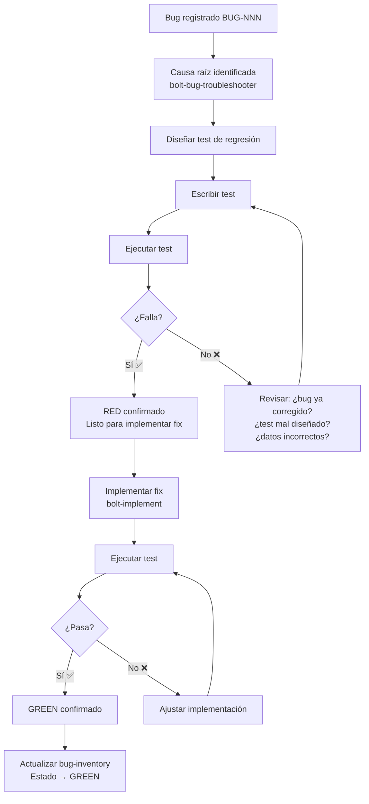

# Bolt Regression Test

Skill de generación de tests E2E con Playwright que reproducen bugs documentados. Opera en la
**fase RED** del ciclo TDD para corrección de bugs: el test debe FALLAR antes del fix y PASAR
después.

## Principio Operativo

> "Un bug sin test de reproducción automatizado VOLVERÁ a aparecer."

El test de regresión es la **prueba viva** de que el bug existió y está corregido. Si el test
pasa sin haber hecho cambios, entonces el bug no es reproducible o ya fue corregido — en ambos
casos, el test sigue siendo valioso como guardia de regresión.

## Pre-requisitos

Antes de crear el test, se necesita:

1. **Bug documentado** — archivo `BUG-NNN-investigation.md` con:
   - Pasos de reproducción claros
   - Resultado observado vs esperado
   - Rol de usuario necesario para reproducir
   - Feature/dominio afectado
2. **Causa raíz identificada** (idealmente) — del `bolt-bug-troubleshooter`
3. **Entorno E2E funcional** — Aspire levantado, BD seedeada

## Estructura del Test

### Ubicación y Naming

```text
src/frontend/e2e/tests/<dominio>/bug-NNN-<descripcion-corta>.spec.ts
```

**Reglas de naming**:

- Prefijo: `bug-NNN-` (NNN = ID del bug con padding a 3 dígitos)
- Sufijo descriptivo en kebab-case (máximo 4 palabras)
- Extensión: `.spec.ts`

**Ejemplos**:

- `bug-001-invitation-creates-user.spec.ts`
- `bug-003-compania-association.spec.ts`
- `bug-006-no-review-screen.spec.ts`

### Tags Obligatorios

Todo test de regresión de bug DEBE incluir estos tags:

```typescript
{ tag: ['@regression', '@e2e', '@<dominio>', '@bug-NNN'] }
```

| Tag           | Propósito                                      |
| ------------- | ---------------------------------------------- |
| `@regression` | Marca como test de regresión (suite dedicada)  |
| `@e2e`        | Test end-to-end (requiere backend real)        |
| `@<dominio>`  | Dominio funcional (auth, companias, clientes…) |
| `@bug-NNN`    | Link directo al bug que reproduce              |

### Plantilla Base

```typescript
/**
 * BUG-NNN — <Título del bug>
 *
 * Verifica que <descripción del comportamiento correcto>:
 *   1. <Verificación principal>
 *   2. <Verificación complementaria>
 *
 * Pre-requisito: backend levantado con Aspire, BD seedeada.
 * Rol: <Rol necesario para reproducir>
 *
 * Tags: @regression @e2e @<dominio> @bug-NNN
 */

import { expect } from '@playwright/test';
import { test } from '../../fixtures/auth.fixture';
import { TEST_USERS } from '../../fixtures/test-data';

test.describe(
  'BUG-NNN — <Descripción concisa del comportamiento correcto>',
  { tag: ['@regression', '@e2e', '@<dominio>', '@bug-NNN'] },
  () => {
    test.beforeEach(async ({ dbHelper }) => {
      await dbHelper.resetAndSeed();
    });

    test(
      '<Acción que debe producir el resultado correcto>',
      { tag: ['@regression', '@e2e', '@<dominio>', '@bug-NNN'] },
      async ({ loginPage, page }) => {
        // --- Arrange: Login con el rol necesario ---
        await loginPage.goto();
        await loginPage.loginWithCredentials(
          TEST_USERS['<ROL>_USER'].email,
          TEST_USERS['<ROL>_USER'].password
        );
        await expect(page).toHaveURL(/\/dashboard/, { timeout: 15_000 });

        // --- Act: Reproducir los pasos del bug ---
        // <Navegar a la página afectada>
        // <Ejecutar la acción que dispara el bug>

        // --- Assert: Verificar el comportamiento CORRECTO ---
        // <Aserción que FALLARÁ mientras el bug exista>
        // <Aserción que PASARÁ una vez corregido>
      }
    );
  }
);
```

## Reglas de Diseño del Test

### 1. El Test Debe Fallar (RED)

El test se escribe para verificar el **comportamiento correcto** — por tanto, FALLARÁ mientras
el bug exista. NO escribir el test para verificar el bug (assertar el error).

```typescript
// ✅ CORRECTO: verifica el comportamiento deseado (falla hasta el fix)
await expect(userRow).toBeVisible();

// ❌ INCORRECTO: verifica el error actual (pasa sin fix, inútil como regresión)
await expect(userRow).not.toBeVisible();
```

### 2. Independencia Total

Cada test de bug debe ser **completamente independiente**:

- `beforeEach` con `dbHelper.resetAndSeed()` para estado limpio
- No depender del orden de ejecución
- No depender de datos creados por otros tests
- Login propio en cada test (no compartir sesión)

### 3. Un Bug = Un Describe

Agrupar en un solo `test.describe` todos los escenarios de verificación del mismo bug.
Pueden ser múltiples `test()` si el bug tiene varias manifestaciones:

```typescript
test.describe('BUG-001 — Título', { tag: [...] }, () => {
  test('Manifestación A funciona correctamente', async () => { ... });
  test('Manifestación B funciona correctamente', async () => { ... });
});
```

### 4. Timeouts Generosos

Los tests de bug tienden a involucrar flujos más complejos. Usar timeouts razonables:

- Login: `timeout: 15_000`
- Navegación: `timeout: 10_000`
- Carga de datos: `timeout: 10_000`
- Acciones de UI: `timeout: 5_000`

### 5. Evidencia en Caso de Fallo

Configurar Playwright para capturar evidencia cuando el test falle:

- Screenshots automáticos (`screenshot: 'only-on-failure'` — ya configurado globalmente)
- Traces si es necesario (`trace: 'retain-on-failure'`)
- Console logs del navegador

## Flujo de Trabajo Completo



## Patrones por Tipo de Bug

### Bug Funcional (lógica de negocio)

```typescript
test('operación produce el resultado correcto', async ({ loginPage, page }) => {
  await loginPage.goto();
  await loginPage.loginWithCredentials(user.email, user.password);
  await expect(page).toHaveURL(/\/dashboard/, { timeout: 15_000 });

  // Navegar al módulo
  await page.goto('/modulo/accion');
  await page.waitForLoadState('networkidle');

  // Ejecutar acción
  await page.getByRole('button', { name: /realizar acción/i }).click();

  // Verificar resultado correcto
  await expect(page.getByText('Resultado esperado')).toBeVisible({ timeout: 10_000 });
});
```

### Bug de Integración (cross-service)

```typescript
test('datos se sincronizan entre servicios', async ({ loginPage, page }) => {
  await loginPage.goto();
  await loginPage.loginWithCredentials(admin.email, admin.password);
  await expect(page).toHaveURL(/\/dashboard/, { timeout: 15_000 });

  // Crear dato en Servicio A
  await page.goto('/servicio-a/crear');
  await page.locator('#campo').fill('valor');
  await page.getByRole('button', { name: /guardar/i }).click();

  // Verificar que existe en Servicio B
  await page.goto('/servicio-b/listado');
  await page.waitForLoadState('networkidle');

  // Esperar propagación del evento de integración
  await expect(
    page.getByRole('row').filter({ hasText: 'valor' })
  ).toBeVisible({ timeout: 15_000 }); // Timeout mayor para async messaging
});
```

### Bug de UI (visual/interacción)

```typescript
test('elemento se renderiza correctamente', async ({ loginPage, page }) => {
  await loginPage.goto();
  await loginPage.loginWithCredentials(user.email, user.password);
  await expect(page).toHaveURL(/\/dashboard/, { timeout: 15_000 });

  await page.goto('/pagina-afectada');
  await page.waitForLoadState('networkidle');

  // Verificar renderizado correcto
  const elemento = page.locator('[data-testid="elemento-afectado"]');
  await expect(elemento).toBeVisible();
  await expect(elemento).toHaveText(/texto esperado/);
  // Para bugs de layout: verificar posición/tamaño
  await expect(elemento).toHaveCSS('display', 'flex');
});
```

### Bug de Datos (seed/migración)

```typescript
test('datos seedeados existen y son correctos', async ({ loginPage, page }) => {
  await loginPage.goto();
  await loginPage.loginWithCredentials(admin.email, admin.password);
  await expect(page).toHaveURL(/\/dashboard/, { timeout: 15_000 });

  // Navegar al listado que muestra los datos
  await page.goto('/entidad/listado');
  await page.waitForLoadState('networkidle');

  // Verificar que los datos seedeados están presentes
  const rows = page.getByRole('row');
  await expect(rows).toHaveCount(expectedCount + 1); // +1 por header

  // Verificar datos específicos
  await expect(page.getByText('dato-esperado')).toBeVisible();
});
```

### Bug de Autorización (roles/tenant)

```typescript
test('usuario con rol X puede acceder a recurso Y', async ({ loginPage, page }) => {
  await loginPage.goto();
  await loginPage.loginWithCredentials(
    TEST_USERS['ROL_ESPECIFICO'].email,
    TEST_USERS['ROL_ESPECIFICO'].password
  );
  await expect(page).toHaveURL(/\/dashboard/, { timeout: 15_000 });

  // Navegar al recurso que debería ser accesible
  await page.goto('/recurso-protegido');

  // Verificar acceso correcto (no redirige a unauthorized)
  await expect(page).not.toHaveURL(/\/unauthorized/);
  await expect(page).toHaveURL(/\/recurso-protegido/);
  await expect(page.getByRole('heading')).toBeVisible({ timeout: 10_000 });
});
```

## Ejecución

```bash
# Ejecutar solo tests de regresión de bugs
npx playwright test --grep @regression

# Ejecutar test de un bug específico
npx playwright test --grep @bug-001

# Ejecutar todos los bugs de un dominio
npx playwright test --grep "@regression.*@companias"

# Ejecutar en modo headed para debug
npx playwright test --grep @bug-001 --headed

# Verificar que falla (RED) — output esperado: FAILED
npx playwright test bug-001-invitation-creates-user.spec.ts
```

## Checklist de Calidad del Test

Antes de marcar como "RED confirmado", verificar:

- [ ] El test falla POR LA RAZÓN CORRECTA (no por timeout, selector roto o error de fixture)
- [ ] El mensaje de error del assert es claro y apunta al bug
- [ ] El test es independiente (puede ejecutarse solo sin otros tests)
- [ ] El `beforeEach` incluye `dbHelper.resetAndSeed()`
- [ ] Los tags son correctos: `@regression @e2e @<dominio> @bug-NNN`
- [ ] El JSDoc header describe el bug y las verificaciones
- [ ] Los timeouts son razonables (no exageradamente largos)
- [ ] Se usa Page Object Model si la página ya tiene uno
- [ ] Los locators son robustos (role > label > testid, nunca CSS/XPath frágil)
- [ ] El test verifica el comportamiento CORRECTO (no el error actual)

## Integración con Otros Skills

| Antes de este skill           | Este skill              | Después de este skill         |
| ----------------------------- | ----------------------- | ----------------------------- |
| `bolt-bug-tracker` (registro) | **bolt-regression-test** | `bolt-implement` (fix GREEN)  |
| `bolt-bug-troubleshooter` (RCA) | (genera test RED)    | `tdd-workflow` (refactor)     |

### Flujo de actualización post-test

Al confirmar que el test falla correctamente (RED):

1. Actualizar `bug-inventory.md`: Estado → `RED`
2. Registrar el test en la tabla de "Tests E2E de Regresión"
3. El test queda en el proyecto como guardia permanente

## Anti-patrones a Evitar

1. ❌ **Test que pasa sin fix** → revisa los pasos, probablemente no reproduce el bug
2. ❌ **Assertar el error en lugar del comportamiento correcto** → el test debe FALLAR ahora
3. ❌ **Depender de timing** → usar `expect` con auto-waiting, nunca `page.waitForTimeout()`
4. ❌ **Test acoplado a implementación** → assertar resultado de usuario, no detalles internos
5. ❌ **Saltarse el reset de BD** → tests flaky por estado compartido
6. ❌ **Test demasiado grande** → un bug = una verificación clara; si el bug tiene múltiples
   síntomas, usar múltiples `test()` dentro del mismo `describe`
7. ❌ **Locators frágiles** → nunca `nth(3)` o `css=.table > tr:nth-child(4) > td:first-child`
