# Solution Architecture — Vacation Management & Approval System

## Document metadata

| Property           | Value                                                      |
| ------------------ | ---------------------------------------------------------- |
| Project            | VAC-MGT-2026                                               |
| Version            | 1.0                                                        |
| Date               | 2026-08-07                                                 |
| Author             | Solution Architect                                         |
| Status             | Approved                                                   |
| ADR references     | ADR-001 · ADR-002 · ADR-003 · ADR-004 · ADR-005 · ADR-006 |
| Constitution scope | backend · frontend · cloud-platform                        |

---

## 1. System Overview

### 1.1 Core capabilities

| Capability | Description |
|-----------|-------------|
| **Vacation lifecycle** | Employee submission, two-level approval (PM → DM), cancellation |
| **Capacity visualisation** | Team calendar and heat-map with configurable thresholds |
| **Integrations** | Nightly AD sync (Microsoft Graph API) and ServiceNow export/import |
| **Notifications** | Event-driven email (primary) and Teams (capacity alerts) |
| **Reporting & audit** | 7-year immutable audit log, predefined reports, admin configuration |

### 1.2 Technology stack

| Layer | Technology |
|-------|-----------|
| Frontend SPA | Vue 3 · TypeScript · Vite · Pinia · MSAL.js v3 |
| Backend API | C# · .NET 10 · Minimal APIs · Modular Monolith · Simple CQRS |
| Persistence | Azure SQL (EF Core writes + Dapper reads) |
| Caching | Azure Cache for Redis (L2) + `IMemoryCache` (L1) |
| Messaging | Azure Service Bus (Standard tier) |
| Identity | Microsoft Entra ID · Managed Identity |
| Hosting | Azure Container Apps (API) · Azure Static Web Apps (SPA) |
| IaC | Terraform · workspaces: dev / prod |
| CI/CD | Azure DevOps Pipelines · GitFlow |
| Observability | OpenTelemetry → Azure Monitor · Application Insights |
| Local dev | .NET Aspire AppHost · Dashboard :15888 |

---

## 2. C4 Level 1 — System Context

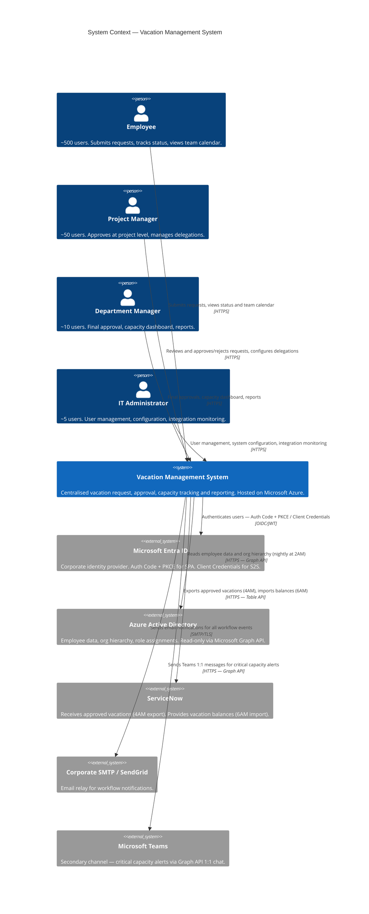

---

## 3. C4 Level 2 — Container Diagram

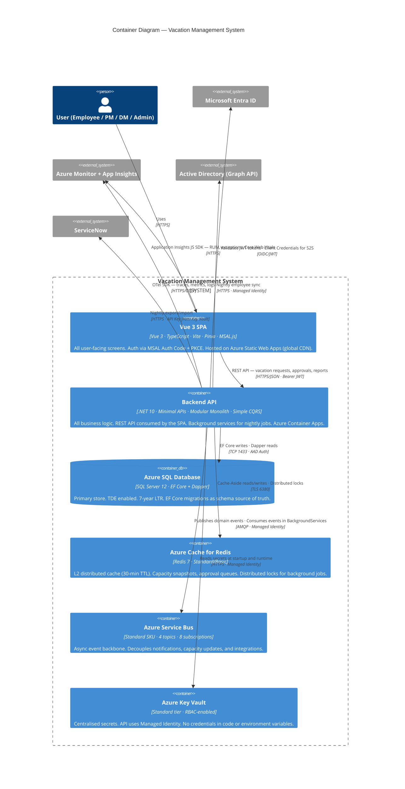

---

## 4. C4 Level 3 — Component Diagram (Backend)

The backend is a **Modular Monolith** — a single deployable process with explicit module
boundaries enforced by NetArchTest. Cross-module communication happens only through CQRS
dispatchers, never via direct class references.

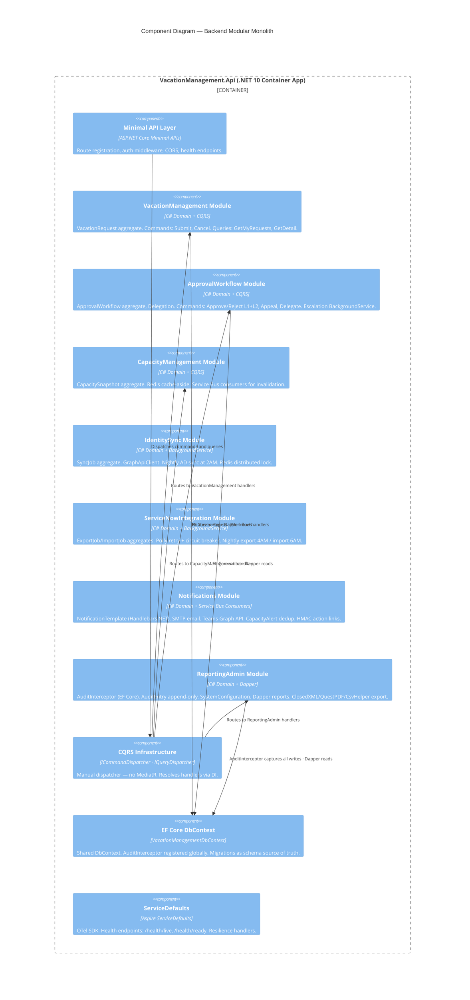

### 4.1 CQRS binding contracts (immutable by constitution)

```csharp
public interface ICommand { }
public interface ICommandHandler<in TCommand> where TCommand : ICommand
    { Task HandleAsync(TCommand command, CancellationToken ct = default); }
public interface ICommandHandler<in TCommand, TResult> where TCommand : ICommand
    { Task<TResult> HandleAsync(TCommand command, CancellationToken ct = default); }
public interface IQuery<TResult> { }
public interface IQueryHandler<in TQuery, TResult> where TQuery : IQuery<TResult>
    { Task<TResult> HandleAsync(TQuery query, CancellationToken ct = default); }
public interface ICommandDispatcher
    { Task DispatchAsync<TCommand>(TCommand command, CancellationToken ct = default) where TCommand : ICommand; }
public interface IQueryDispatcher
    { Task<TResult> DispatchAsync<TQuery, TResult>(TQuery query, CancellationToken ct = default) where TQuery : IQuery<TResult>; }
public interface IDomainEvent { Guid EventId { get; } DateTime OccurredOn { get; } }
```

### 4.2 Module directory structure

```
src/backend/
├── src/
│   ├── Api/                          ← Minimal API layer (routes, middleware, auth)
│   ├── Modules/
│   │   ├── VacationManagement/       ← F-001: Domain / Application / Infrastructure / Api
│   │   ├── ApprovalWorkflow/         ← F-002
│   │   ├── CapacityManagement/       ← F-003
│   │   ├── IdentitySync/             ← F-004
│   │   ├── ServiceNowIntegration/    ← F-005
│   │   ├── Notifications/            ← F-006
│   │   └── ReportingAdmin/           ← F-007
│   ├── Infrastructure/
│   │   ├── Cqrs/                     ← CommandDispatcher, QueryDispatcher
│   │   └── Persistence/              ← DbContext, AuditInterceptor, Migrations
│   └── Domain/Common/                ← BaseEntity, IDomainEvent, AggregateRoot
└── tests/
    ├── VacationManagement.ReqnrollTests/
    └── ...
```

### 4.3 Cross-module boundary rules (NetArchTest)

| Rule | Tool |
|------|------|
| Module A must not directly reference classes from Module B | `DoNotHaveDependencyOn` |
| Application layer must not reference Infrastructure layer | Layer dependency rule |
| Domain layer has zero external package dependencies | `OnlyHaveDependenciesOn(["System.*"])` |

---

## 5. Deployment Architecture

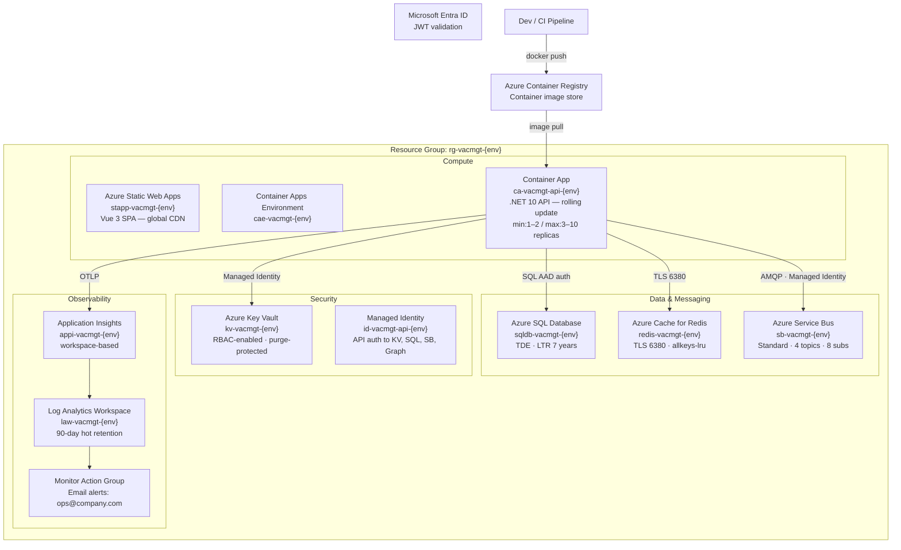

### 5.1 Environment matrix

| Attribute | dev | prod |
|-----------|-----|------|
| SQL SKU | S1 (10 DTUs) | GP_Gen5_2 (2 vCores) |
| Redis SKU | Basic C0 | Standard C1 |
| API min replicas | 1 | 2 |
| API max replicas | 3 | 10 |
| Terraform workspace | `dev` | `prod` |
| Deploy trigger | Auto on `develop` push | Manual approval on `main` push |

---

## 6. Integration Architecture

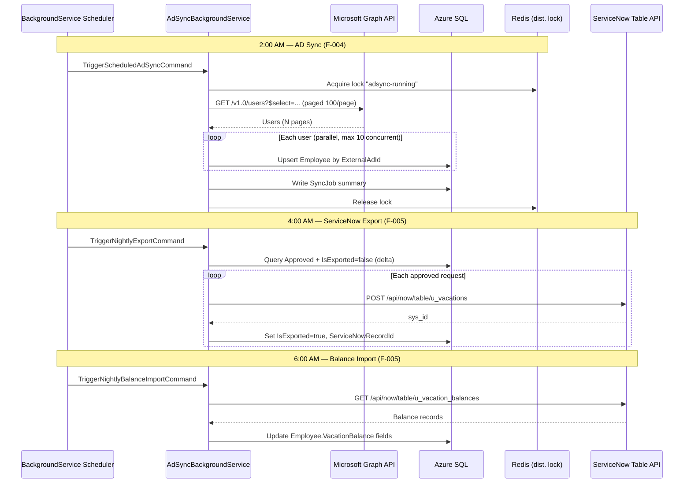

### 6.1 Integration resilience

| Integration | Auth | Retry | Circuit breaker |
|------------|------|-------|----------------|
| Microsoft Graph API | Managed Identity (Client Credentials) | 3× exp backoff (1s→5s→30s) | N/A (paged; retry per page) |
| ServiceNow Table API | API Key from Key Vault | 3× exp backoff (1s→5s→30s) | 5 failures → open 60s → alert admin |
| SMTP/SendGrid | Credentials from Key Vault | 3× retry | N/A |
| Microsoft Teams Graph | Managed Identity | 3× retry | Failure does NOT block email (BR-095) |

---

## 7. Event-Driven Architecture

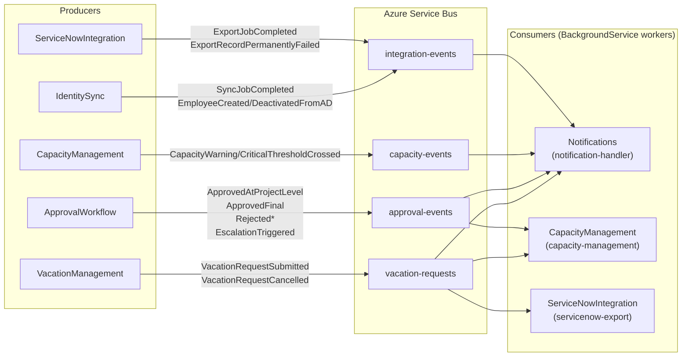

**Delivery guarantees:** At-least-once; consumers are idempotent (event IDs deduplicate). DLQ on all subscriptions (max 5 deliveries). Message TTL 14 days.

---

## 8. Data Architecture

### 8.1 EF Core write model vs. Dapper read model

| Operation | Tool | Reason |
|-----------|------|--------|
| Submit / Cancel / Approve commands | EF Core | Change tracking, optimistic concurrency, domain event dispatch |
| `GetMyVacationRequestsQuery` | Dapper | Paginated projection — no entity hydration needed |
| `GetCapacityHeatMapQuery` | Dapper | Pure read from `CAPACITY_SNAPSHOTS` pre-computed table |
| `GetVacationHistoryReportQuery` | Dapper | Multi-table join with large date range |
| `GetAuditTrailQuery` | Dapper | 1M+ rows — covering index required |

### 8.2 Data retention policies

| Data | Retention | Mechanism |
|------|-----------|-----------|
| Audit entries | 7 years (compliance) | Azure SQL LTR + `HasNoDelete()` EF config |
| Sync / Export job history | 90 days | Application-level purge |
| Capacity snapshots | 2 years | Application-level purge (report coverage) |
| Database backups | 35 days short-term | Azure SQL auto-backup |

---

## 9. Caching Architecture

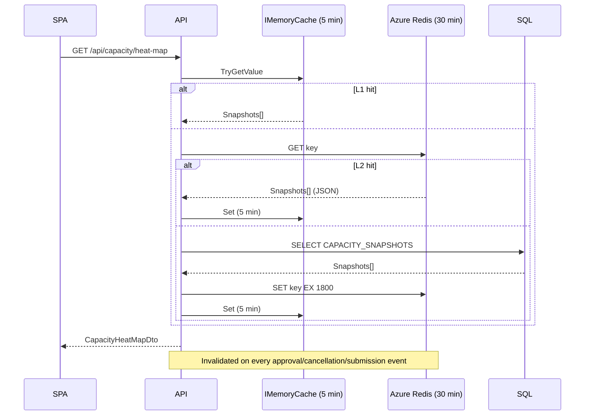

---

## 10. Authentication & Authorization

### 10.1 Auth flows

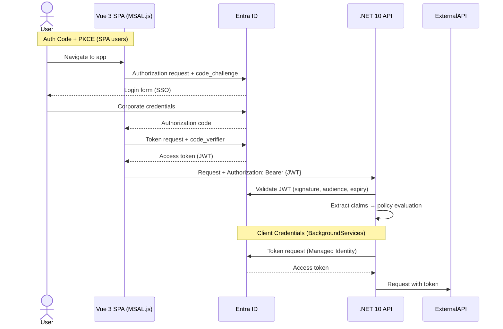

### 10.2 Authorization policies

| Policy | Required claim | Accessible to |
|--------|---------------|---------------|
| `RequireEmployee` | Any authenticated role | All authenticated users |
| `RequireProjectManager` | `role = ProjectManager` | PMs + DMs + Admins |
| `RequireDepartmentManager` | `role = DepartmentManager` | DMs + Admins |
| `RequireAdministrator` | `role = Administrator` | Admins only |
| `RequireAdminOrAuditor` | `Administrator OR Auditor` | Admins + Auditors |

---

## 11. Security Architecture

### 11.1 Secrets management — zero-trust model

```
NEVER: appsettings.json → connection string
NEVER: Container App environment variable → plain text secret
ALWAYS: Azure Key Vault → Container App Secret reference → Managed Identity
```

| Secret | Stored in | Accessed via |
|--------|-----------|--------------|
| Azure SQL connection string | Key Vault | Container App KV reference + Managed Identity |
| Redis connection string | Key Vault | Container App KV reference + Managed Identity |
| ServiceNow API key | Key Vault | `SecretClient` + `DefaultAzureCredential` |
| SMTP credentials | Key Vault | `SecretClient` + `DefaultAzureCredential` |
| HMAC signing key | Key Vault | `SecretClient` + `DefaultAzureCredential` |

### 11.2 OWASP Top 10 controls

| OWASP | Control |
|-------|---------|
| A01 Broken Access Control | Policy-based authz; role-scoped Dapper queries (DM sees own dept) |
| A02 Cryptographic Failures | TLS 1.2+ (enforced at ACA ingress); Azure SQL TDE; Key Vault for all secrets |
| A03 Injection | EF Core parameterised; Dapper parameter objects — no string concatenation |
| A05 Security Misconfiguration | Checkov/tfsec 0 Critical gate in IaC pipeline |
| A06 Vulnerable Components | SCA (Dependency-Check) in every PR — fail on Critical |
| A07 Auth Failures | MSAL JWT Bearer validation; `ValidateLifetime = true`; PKCE on SPA |
| A09 Logging Failures | OTel 100% API trace coverage; `AuditInterceptor` all state changes |
| A10 SSRF | ServiceNow URL pinned in Key Vault config; no user-controlled URLs |

### 11.3 GDPR compliance baseline

| Requirement | Implementation |
|-------------|---------------|
| Data minimisation | Only minimum necessary AD fields synced; no PII in email bodies beyond names |
| Encryption at rest | Azure SQL TDE (default); Key Vault-managed keys |
| Right to erasure | `Employee.IsActive = false` (soft-delete); `[AuditRedact]` attribute on PII fields |
| Audit trail | `AuditEntry` append-only — every data change with actor, timestamp, before/after |
| 7-year retention | Azure SQL LTR policy (P7Y); `AuditEntry` `HasNoDelete()` EF config |

---

## 12. Observability Architecture

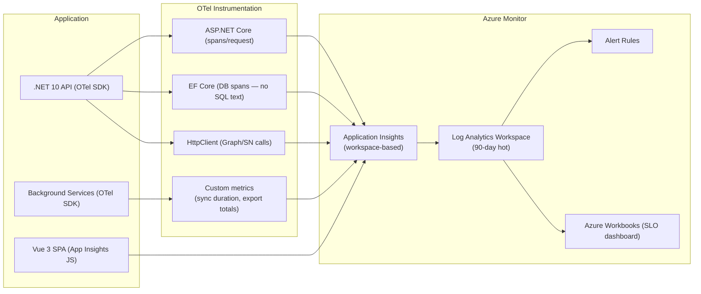

### 12.1 SLOs and alert thresholds

| SLO | Target | Alert |
|-----|--------|-------|
| API availability | ≥ 99.5% | < 99% over 15 min |
| API P95 latency | < 300 ms | > 1 s sustained 5 min |
| AD sync success | ≥ 99% | Error rate > 5% |
| ServiceNow export success | ≥ 99% | Permanent failure (3 retries exhausted) |

### 12.2 Health endpoints

| Endpoint | Purpose | Probe |
|----------|---------|-------|
| `/health/live` | Process alive | Container Apps liveness probe every 30s |
| `/health/ready` | SQL + Redis reachable | Container Apps readiness probe every 15s |
| `/health` | Combined | Azure Monitor Resource Health |

---

## 13. Frontend Architecture

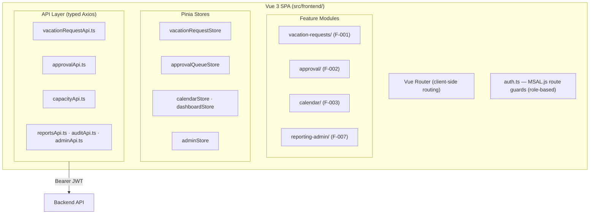

**Naming conventions (constitution XIV):** `kebab-case` files · `PascalCase` components · `use + camelCase` composables · 2-space indent · 100-char max line · no semicolons · single quotes.

---

## 14. CI/CD Architecture

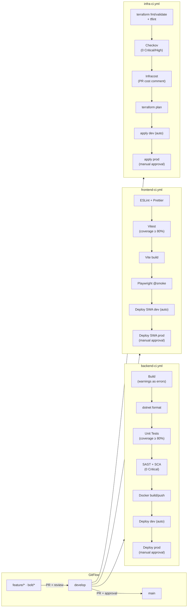

---

## 15. Non-Functional Requirements Mapping

| NFR | Target | Architecture mechanism |
|-----|--------|----------------------|
| API P95 latency | < 300 ms | Redis L2 cache; Dapper reads; `IMemoryCache` L1 |
| Calendar render | < 1 s | Pre-computed `CAPACITY_SNAPSHOTS`; covering indexes |
| Report generation | < 5 s | Dapper + covering indexes; max 2-year range |
| Availability | ≥ 99.5% | ACA min 2 replicas (prod); Azure SQL SLA 99.99% |
| Scalability | 560 concurrent users | ACA HTTP scale rule (50 req/replica) |
| AD sync | < 30 min / 500 users | Parallel upsert (max 10); cursor-based Graph paging |
| ServiceNow export | < 15 min / 50 records | Sequential async; circuit breaker skips on SN downtime |
| Security | OWASP Top 10 | SAST gate; SCA gate; Checkov; Managed Identity; Key Vault |
| GDPR | Compliant | `[AuditRedact]`; soft-delete; right-to-erasure API; consent flow |
| Audit retention | 7 years | Azure SQL LTR (P7Y); `AuditEntry` append-only |
| Code coverage | ≥ 80% / 75% | Coverlet gate (BE); Vitest gate (FE) |
| Accessibility | WCAG 2.1 AA | axe-core in Playwright E2E; Lighthouse CI |

---

## 16. Architecture Decision Index

| ADR | Decision | Status |
|-----|---------|--------|
| ADR-001 | C# / .NET 10 / Minimal APIs | Accepted |
| ADR-002 | Modular Monolith + Simple CQRS (no MediatR) | Accepted |
| ADR-003 | Azure SQL + EF Core (writes) + Dapper (reads) | Accepted |
| ADR-004 | Vue 3 + TypeScript + Vite + Pinia + Azure Static Web Apps | Accepted |
| ADR-005 | Azure Container Apps + Terraform | Accepted |
| ADR-006 | Azure DevOps Pipelines + OTel→Azure Monitor + GDPR baseline | Accepted |

### 16.1 Hard constraints from constitution (require governance to change)

1. **No MediatR** — manual `ICommandDispatcher` / `IQueryDispatcher`
2. **No VNet / private endpoints** — deferred to post-MVP
3. **No WAF** — deferred to post-MVP
4. **No AKS** — Azure Container Apps is mandatory
5. **No Event Sourcing** — not justified for this domain
6. **TLS 1.2+ everywhere** — enforced at ACA ingress and Redis
7. **Managed Identity only** — no stored credentials anywhere
8. **Key Vault for all secrets** — no secrets in code, pipelines, or env vars
9. **Nullable reference types enabled** in all `.csproj`
10. **GitFlow branching** — no direct commits to `develop` or `main`
